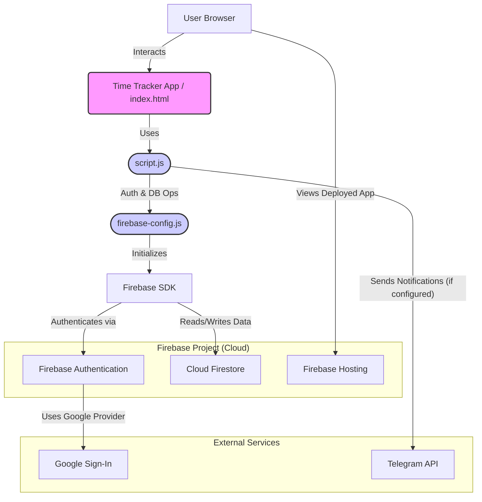

# Time Tracker Firebase Setup Guide

This guide outlines the steps to configure your Time Tracker application with Firebase, enabling authentication, database storage, and optional hosting.

## Phase 1: Firebase Configuration (Local Project Files)

1.  **Retrieve Firebase Configuration:**
    *   Go to the [Firebase Console](https://console.firebase.google.com/).
    *   Select your Firebase project (or create a new one if you haven't already).
    *   Navigate to **Project settings** (click the gear icon ⚙️ near "Project Overview" in the left sidebar).
    *   Under the "General" tab, scroll down to the "Your apps" section.
    *   If you haven't registered your web app yet, click on the web icon (`</>`) to "Add app", choose "Web", give it a nickname, and register the app.
    *   Once your web app is registered (or if it was already there), find it in the "Your apps" list.
    *   Look for the "SDK setup and configuration" section and select the "Config" option (radio button).
    *   You will see a `firebaseConfig` object. This object contains your unique `apiKey`, `authDomain`, `projectId`, `storageBucket`, `messagingSenderId`, and `appId`. Copy these values.

2.  **Update `firebase-config.js`:**
    *   Open the file `time-tracker/firebase-config.js` in your code editor.
    *   Locate the `firebaseConfig` constant:
        ```javascript
        const firebaseConfig = {
          apiKey: "your-api-key",
          authDomain: "your-project.firebaseapp.com",
          projectId: "your-project-id",
          storageBucket: "your-project.appspot.com",
          messagingSenderId: "your-messaging-sender-id",
          appId: "your-app-id"
        };
        ```
    *   Replace the placeholder string values (e.g., `"your-api-key"`) with the actual corresponding values you copied from your Firebase project settings.

3.  **Update Telegram Configuration (Optional but Recommended for Notifications):**
    *   If you intend to use the Telegram notification feature:
    *   Open the file `time-tracker/script.js`.
    *   Locate the Telegram configuration constants:
        ```javascript
        const TELEGRAM_BOT_TOKEN = 'your_bot_token';
        const TELEGRAM_CHAT_ID = 'your_chat_id';
        ```
    *   Replace `'your_bot_token'` with your actual Telegram Bot Token.
    *   Replace `'your_chat_id'` with your target Telegram Chat ID.
    *   **How to get these:**
        *   **Bot Token:**
            1.  Open Telegram and search for "BotFather" (it's a verified bot).
            2.  Start a chat with BotFather and send `/newbot` command.
            3.  Follow the instructions to name your bot and choose a username for it.
            4.  BotFather will provide you with an API token. This is your `TELEGRAM_BOT_TOKEN`.
        *   **Chat ID:**
            *   **For a private chat with your bot:** Your user ID is the chat ID. You can send a message to your bot, then use a bot like `@userinfobot` or `@get_id_bot` by forwarding a message from your bot to it, or by sending `/start` to it.
            *   **For a group chat:**
                1.  Add your bot to the Telegram group.
                2.  Send any message to the group.
                3.  You can use a bot like `@get_id_bot` (add it to the group temporarily, it will show the group ID which starts with a hyphen `-`) or use the Telegram Bot API by sending a request to `https://api.telegram.org/bot<YOUR_BOT_TOKEN>/getUpdates`. Look for the `chat` object and its `id` in the response from the group.

## Phase 2: Firebase Services Setup (in Firebase Console)

1.  **Enable Google Sign-In:**
    *   In the Firebase Console, navigate to your project.
    *   In the left sidebar, go to **Authentication** (under "Build").
    *   Select the "Sign-in method" tab.
    *   Find "Google" in the list of "Sign-in providers" (it might be under "Additional providers" or "Native providers").
    *   Click on "Google".
    *   Enable the provider by toggling the switch.
    *   You will need to select a **Project support email** from the dropdown menu. This is typically the email address associated with your Google Cloud/Firebase project.
    *   Click "Save".
    *   For web-based Google Sign-In using the Firebase SDK's `signInWithPopup` method, Firebase usually handles the necessary OAuth client IDs and secrets automatically behind the scenes, especially when using the default Firebase project setup. You generally do not need to create separate credentials in the Google Cloud Console for this basic web integration.

2.  **Set up Cloud Firestore Database:**
    *   In the Firebase Console, navigate to your project.
    *   In the left sidebar, go to **Firestore Database** (under "Build").
    *   Click "Create database".
    *   Choose to start in **test mode** for initial development. This allows open access for a limited time. You will secure it with rules shortly.
        *   *Note: For production, you should always start in production mode with secure rules.*
    *   Choose a Cloud Firestore location (select a region geographically close to your users). This cannot be changed later.
    *   Click "Enable".

3.  **Add Firestore Security Rules:**
    *   After Firestore is created, stay in the Firestore Database section and go to the "Rules" tab.
    *   You will see a default set of rules. Delete them.
    *   Open your local project file `time-tracker/firestore.rules`. It should contain:
        ```
        rules_version = '2';
        service cloud.firestore {
          match /databases/{database}/documents {
            match /activities/{activity} {
              allow read: if request.auth != null;
              allow write: if request.auth != null &&
                           request.resource.data.userId == request.auth.uid;
            }
          }
        }
        ```
    *   Copy the entire content of this `firestore.rules` file.
    *   Paste these rules into the rules editor in the Firebase Console.
    *   Click "Publish" to save and apply the new rules. These rules allow any authenticated user to read activities, but only allow users to write activities if the `userId` in the document matches their own authenticated `uid`.

## Phase 3: Deployment (Optional - for Hosting on Firebase)

If you want to host your time tracker application on Firebase Hosting:

1.  **Install Firebase CLI (Command Line Interface):**
    *   If you don't have it installed globally, open your computer's terminal or command prompt and run:
        ```bash
        npm install -g firebase-tools
        ```
    *   *(Requires Node.js and npm to be installed first.)*

2.  **Login to Firebase:**
    *   In your terminal, run the command:
        ```bash
        firebase login
        ```
    *   This will open a browser window asking you to log in with your Google account associated with Firebase and grant permissions to the Firebase CLI.

3.  **Initialize Firebase in Your Project Directory:**
    *   Navigate to your `time-tracker` project's root directory in the terminal (e.g., `cd path/to/your/time-tracker`).
    *   Run the command:
        ```bash
        firebase init
        ```
    *   The CLI will ask you a series of questions:
        *   "Are you ready to proceed? (Y/n)" -> **Y**
        *   "Which Firebase features do you want to set up for this folder? Press Space to select features, then Enter to confirm." -> Use arrow keys to navigate to **Hosting: Configure files for Firebase Hosting and (optionally) set up GitHub Action deploys**. Press `Space` to select it (it should show `(*)`), then press `Enter`.
        *   "Please select an option:" -> Choose **Use an existing project**.
        *   "Select a default Firebase project for this directory:" -> Use arrow keys to select the Firebase project you've been configuring in the Firebase Console, then press `Enter`.
        *   "What do you want to use as your public directory?" -> Type `.` (a single dot, representing the current directory) and press `Enter`. This is because your `index.html` is in the root of the `time-tracker` folder.
        *   "Configure as a single-page app (rewrite all urls to /index.html)?" -> Type `y` and press `Enter`.
        *   "Set up automatic builds and deploys with GitHub?" -> Type `n` (unless you want to configure this now) and press `Enter`.
        *   "File public/index.html already exists. Overwrite? (y/N)" -> Type `N` (important, to keep your existing `index.html`). If your public directory was different and it found an `index.html` there, you'd also likely say No.

4.  **Deploy Your Application:**
    *   After initialization is complete, you can deploy your application to Firebase Hosting by running:
        ```bash
        firebase deploy
        ```
    *   Once deployment is successful, the Firebase CLI will output a "Hosting URL". This is the live URL where your time tracker application is accessible.

## Application Architecture Diagram



After completing these steps, your Time Tracker application should be fully connected to Firebase and operational. Remember to replace all placeholder values in your configuration files with your actual credentials.